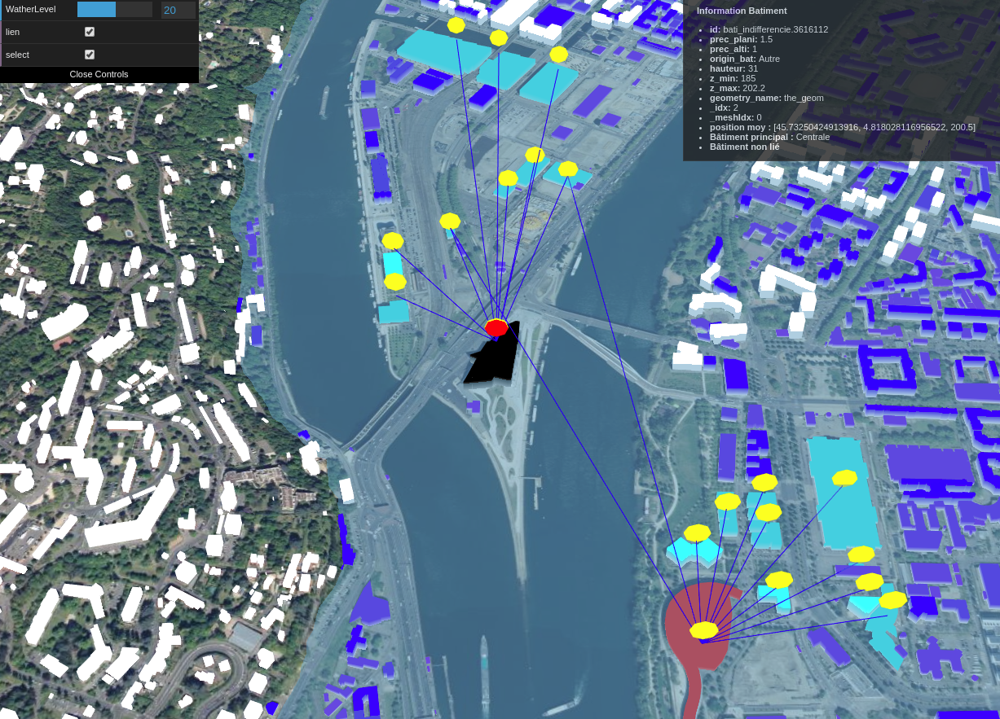

<h1>Modélisation de l'inondation de Lyon</h1>

<h2>Analyse du sujet</h2>

Nous devons réaliser un site web pour visualiser, en fonction du niveau de l'inondation de Lyon, les bâtiments touchés (directement ou indirectement).

<h2>Implémentation</h2>

- Modélisation d'une inondation pour la ville de lyon (niveau de l'eau)

- Création du menu de gestion du niveau de l'eau et des bâtiments
 - niveau de l'eau
 - affichage relatif au bâtiment
  - corespondance de la couleur
  - lien entre les bâtiments
  - logo selon innondation
  - informations sur les liens au clic sur un bâtiment

- Récupération des données d'un bâtiment (coordonnées, altitude minimun, type)

- Liste des bâtiments (type, lien avec les autres bâtiments)

- Gestion de l'affichage des bâtiments
 - inondé ou non (couleur)
 - type (couleur / logo)
 
- Visualisation des liens entre les bâtiments selon choix dans le menu de gauche (lien)

- Visualisation des bâtiments liés (couleurs) selon choix dans le menu (select)

- Bâtiments affectés par l'inondation (directe ou indirecte) 

    ex : inondation d'une centrale qui entraine une coupure d'électricité

<h2>Problèmes</h2>

Isolation des données sur les bâtiments : ! Problèmes résolus !

Fichier Feature2Mesh fonction [coordinateToPolygonExtruded](https://github.com/iTowns/itowns/blob/master/src/Renderer/ThreeExtended/Feature2Mesh.js#L241-L284)

- pb 1 : les bâtiment sont tous regroupés en un seul mesh alors que nous avons besoin d'un mesh par bâtiments pour le projet (travail sur la couleur et la mise en place de lien entre les bâtiments ou logo) et de leur lier leurs propriétés
- pb 2 : la modification du Feature2Mesh.js n'entraine aucun changement dans l'affichage. Comment faire en sorte que les changements soient pris en compte ?

<h2>Installation</h2>
[Lien vers les instructions d'installation](https://gitlab.com/LSchlegel/itowns_inondation/blob/master/BUILDING.md)